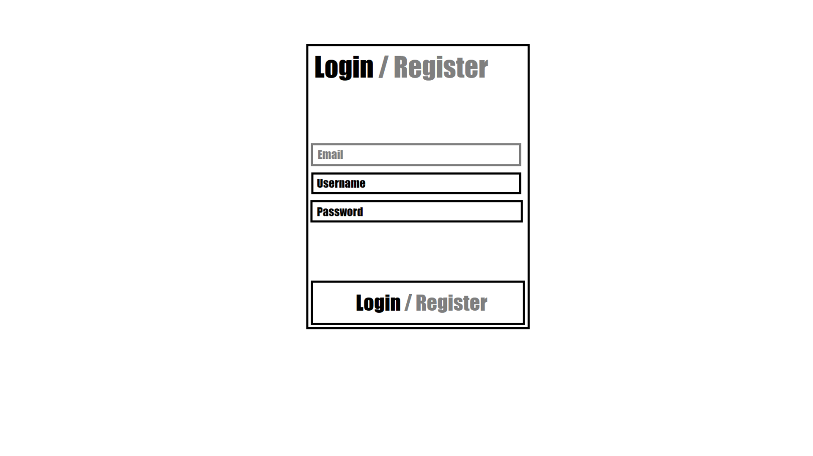
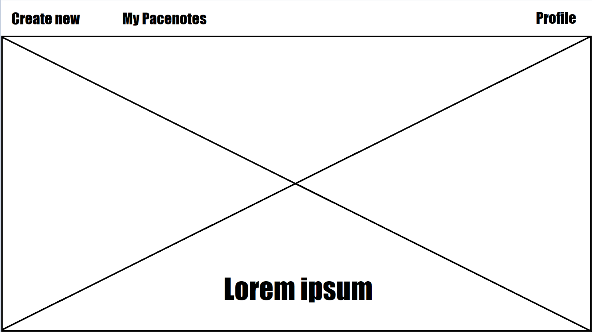
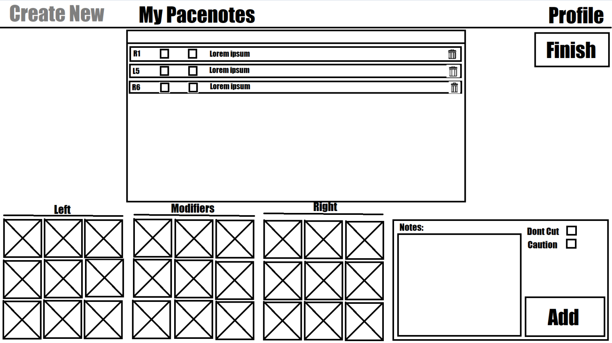
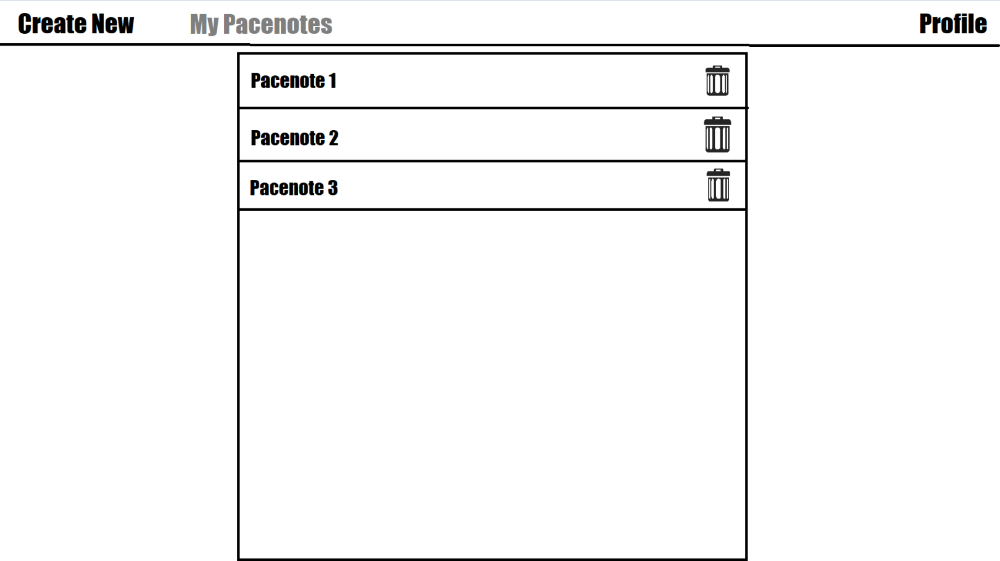
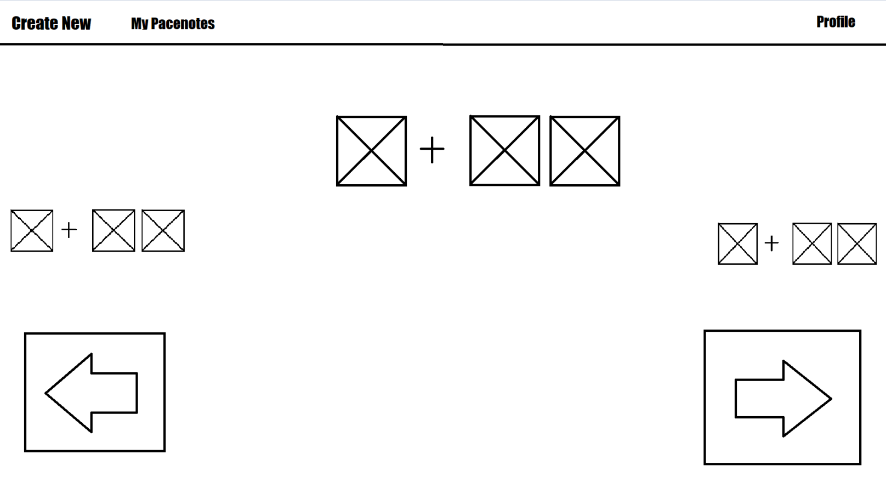
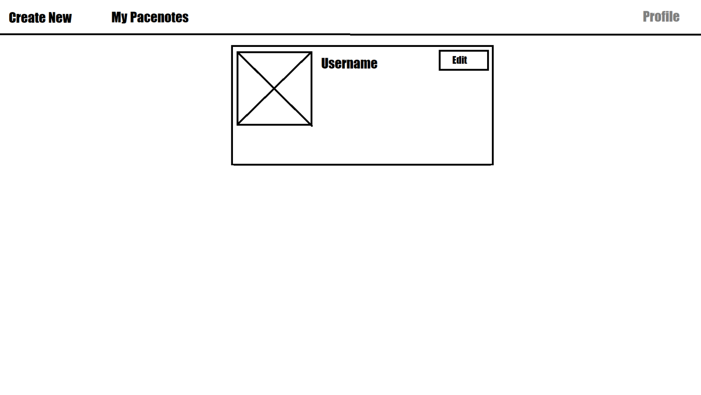

# Wireframe Screenshotid ja funktsionaalsused

## Login/Register

Selles vaates saab kasutaja sisse logida, mille jaoks on tal vaja usernamei ja passwordi, juhul kui kasutaja pole veel kontot loonud saab ta ennast kasutajaks registreerida ja selleks on vajalik ka email. (Login ja Register vaated on muidu eraldi aga kuna tegemist sarnaste vaadetega siis tegime vaid ühe vaate)

## Peamenüü

Peamenüü vaade avaneb peale sisselogimist ja selles on kasutajal kolm valikut: saab uusi Pacenote teha, saab tehtud Pacenote vaadata ja n-ö selle lehe peafunktsiooni kasutada ning kolmandaks saab profiili vaadata ja muuta enda andmeid. Potensiaalselt on peamenüü koht kuhu tuleb mingi väline API päring.

## Create new

Create new vaates saab kasutaja luua uusi pacenote, selleks peab valima vajalikud märkmed, mis on pildi all osas märgitud Left, Modifiers ja Right, siis nendest paremale jäävas kastis saab lisada veel märkmeid ja lõpuks kui vajutada Add nupule ilmub see note ekraani keskel olevasse kasti ja siis kui kõik pacenoteid on tehtud tuleb vajutada Finish nuppu ja see salvestab tehtud töö.

## My Pacenotes

Selles vaates on näha mis Pacenote kasutaja teinud on ja kui mingile Pacenote'ile peale vajutada tekib järgmine vaade.

## View Pacenotes

See vaade ongi siis selle lehe põhifunktsioon, nimelt kui eelmisest vaatest valisid millist pacenote vaadata tahad siis siin see avaneb. Täpsemalt on siis lehe keskel note mida kaardilugeja ütlema peab, sellest paremale jääb väiksemalt järgmine note, mis liigub lehe keskele kui vajutada edasi noolt ja samamoodi näeb lehe vasakult poolt just olnud note ja nendeni saab ka liikuda vajutades tagasi noolt.

## Profile

Profile vaates saab näha enda kasutajat ja muuta andmeid enda kohta.


<a href="https://demo-nextjs-with-supabase.vercel.app/">
  
  <h1 align="center">Next.js and Supabase Starter Kit</h1>
</a>

<p align="center">
 The fastest way to build apps with Next.js and Supabase
</p>

<p align="center">
  <a href="#features"><strong>Features</strong></a> ·
  <a href="#demo"><strong>Demo</strong></a> ·
  <a href="#deploy-to-vercel"><strong>Deploy to Vercel</strong></a> ·
  <a href="#clone-and-run-locally"><strong>Clone and run locally</strong></a> ·
  <a href="#feedback-and-issues"><strong>Feedback and issues</strong></a>
  <a href="#more-supabase-examples"><strong>More Examples</strong></a>
</p>
<br/>

## Features

- Works across the entire [Next.js](https://nextjs.org) stack
  - App Router
  - Pages Router
  - Middleware
  - Client
  - Server
  - It just works!
- supabase-ssr. A package to configure Supabase Auth to use cookies
- Styling with [Tailwind CSS](https://tailwindcss.com)
- Optional deployment with [Supabase Vercel Integration and Vercel deploy](#deploy-your-own)
  - Environment variables automatically assigned to Vercel project

## Demo

You can view a fully working demo at [demo-nextjs-with-supabase.vercel.app](https://demo-nextjs-with-supabase.vercel.app/).

## Deploy to Vercel

Vercel deployment will guide you through creating a Supabase account and project.

After installation of the Supabase integration, all relevant environment variables will be assigned to the project so the deployment is fully functioning.

[](https://vercel.com/new/clone?repository-url=https%3A%2F%2Fgithub.com%2Fvercel%2Fnext.js%2Ftree%2Fcanary%2Fexamples%2Fwith-supabase&project-name=nextjs-with-supabase&repository-name=nextjs-with-supabase&demo-title=nextjs-with-supabase&demo-description=This%20starter%20configures%20Supabase%20Auth%20to%20use%20cookies%2C%20making%20the%20user's%20session%20available%20throughout%20the%20entire%20Next.js%20app%20-%20Client%20Components%2C%20Server%20Components%2C%20Route%20Handlers%2C%20Server%20Actions%20and%20Middleware.&demo-url=https%3A%2F%2Fdemo-nextjs-with-supabase.vercel.app%2F&external-id=https%3A%2F%2Fgithub.com%2Fvercel%2Fnext.js%2Ftree%2Fcanary%2Fexamples%2Fwith-supabase&demo-image=https%3A%2F%2Fdemo-nextjs-with-supabase.vercel.app%2Fopengraph-image.png&integration-ids=oac_VqOgBHqhEoFTPzGkPd7L0iH6)

The above will also clone the Starter kit to your GitHub, you can clone that locally and develop locally.

If you wish to just develop locally and not deploy to Vercel, [follow the steps below](#clone-and-run-locally).

## Clone and run locally

1. You'll first need a Supabase project which can be made [via the Supabase dashboard](https://database.new)

2. Create a Next.js app using the Supabase Starter template npx command

   ```bash
   npx create-next-app -e with-supabase
   ```

3. Use `cd` to change into the app's directory

   ```bash
   cd name-of-new-app
   ```

4. Rename `.env.local.example` to `.env.local` and update the following:

   ```
   NEXT_PUBLIC_SUPABASE_URL=[INSERT SUPABASE PROJECT URL]
   NEXT_PUBLIC_SUPABASE_ANON_KEY=[INSERT SUPABASE PROJECT API ANON KEY]
   ```

   Both `NEXT_PUBLIC_SUPABASE_URL` and `NEXT_PUBLIC_SUPABASE_ANON_KEY` can be found in [your Supabase project's API settings](https://app.supabase.com/project/_/settings/api)

5. You can now run the Next.js local development server:

   ```bash
   npm run dev
   ```

   The starter kit should now be running on [localhost:3000](http://localhost:3000/).

> Check out [the docs for Local Development](https://supabase.com/docs/guides/getting-started/local-development) to also run Supabase locally.

## Feedback and issues

Please file feedback and issues over on the [Supabase GitHub org](https://github.com/supabase/supabase/issues/new/choose).

## More Supabase examples

- [Next.js Subscription Payments Starter](https://github.com/vercel/nextjs-subscription-payments)
- [Cookie-based Auth and the Next.js 13 App Router (free course)](https://youtube.com/playlist?list=PL5S4mPUpp4OtMhpnp93EFSo42iQ40XjbF)
- [Supabase Auth and the Next.js App Router](https://github.com/supabase/supabase/tree/master/examples/auth/nextjs)
